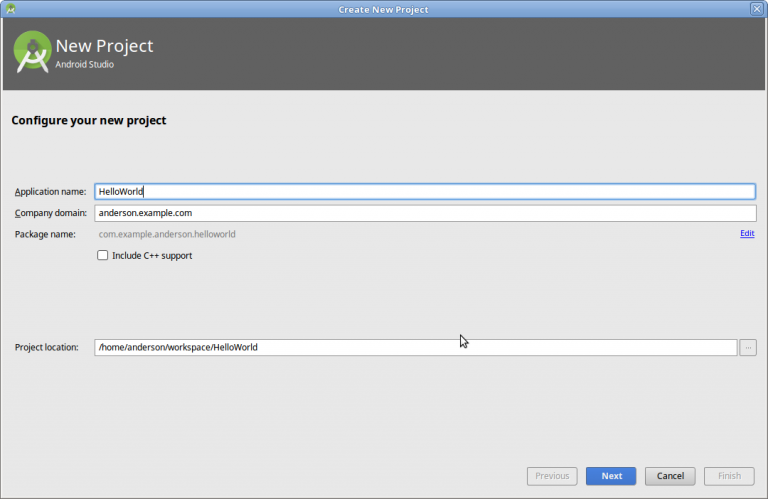
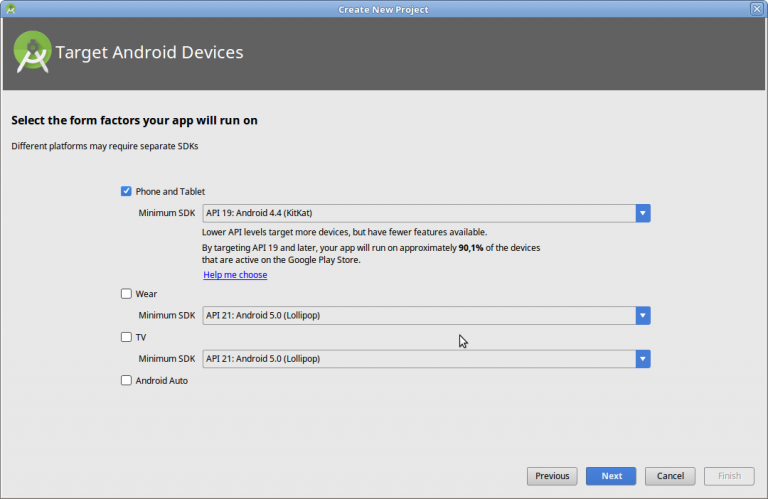
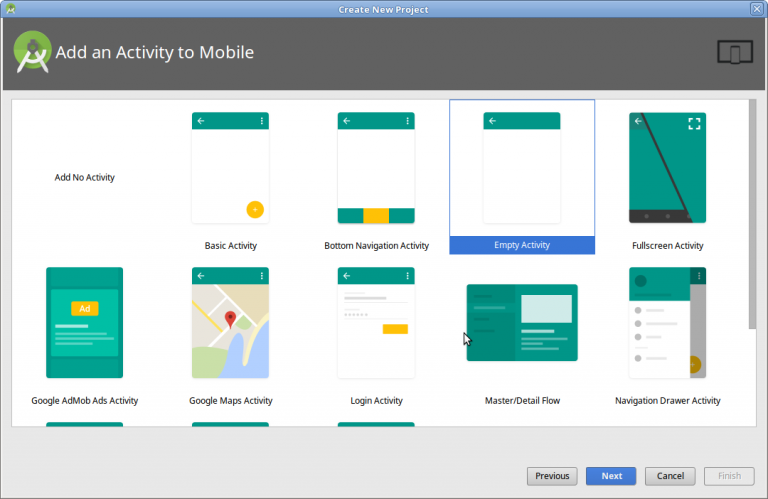
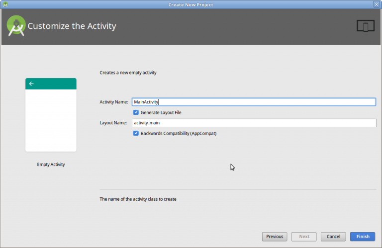
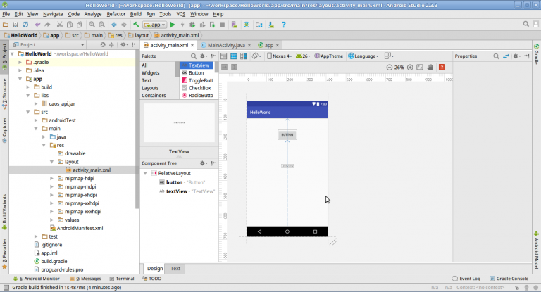
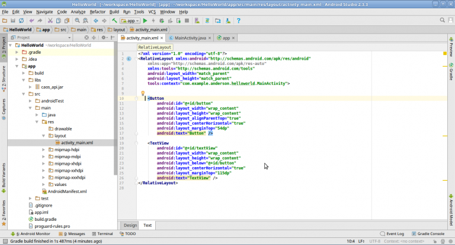
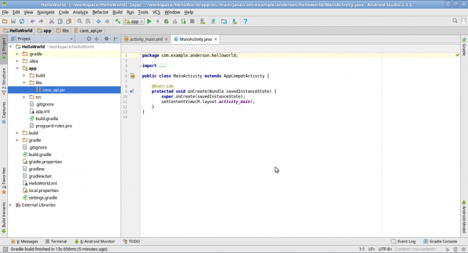
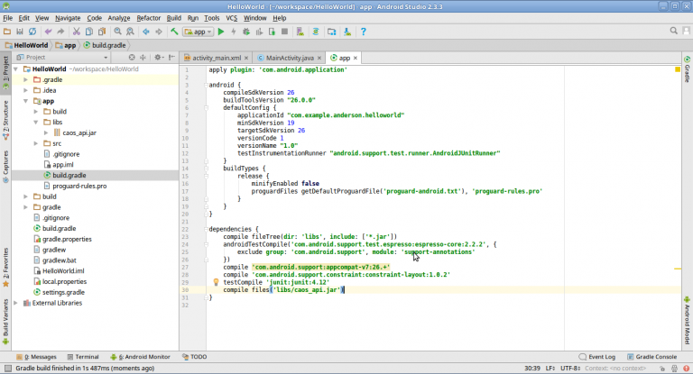
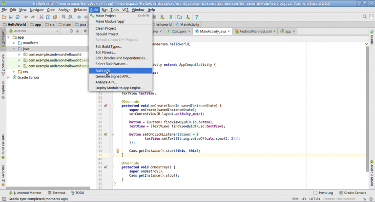

# Processing Offloading

In this tutorial a simple application based on CAOS is developed. For this tutorial, the Android Studio IDE is used. Note: You must install the dependencies and configure the environment. If you did not, follow this [tutorial](Get_Started.md). 

## Initial Project

* Create the Android Project









* Create the user interface of the application





* Insert the CAOS library in the folder "libs" of the project (download [here](downloads/caos_api.jar))



* Insert the command in build.gradle (app): `compile files('libs/caos_api.jar')`



* Create the interface with offloadble methods. Add the annotation to each method that you want and can be offload

```java
package com.example.anderson.helloworld;

import br.ufc.great.caos.api.offload.Offloadable;

public interface ICalc {

    @Offloadable
    public int soma(int a, int b);
}
```

* Create the class that implements the interface

```java
package com.example.anderson.helloworld;

public class Calc implements ICalc {

    @Override
    public int soma(int a, int b) {
        return a + b;
    }
}
```

* Configure the Main class (MainActivity). You need to add the `@CaosConfig` annotation (line 13). The `@Inject` annotation as parameter receives the class that has implemented the interface (line 16). Create an attribute of the interface type (line 17). In the onCreate method, start the CAOS service (line 37) and in the onDestroy method stop the service (line 43). The click event on the button performs the method created on the interface (line 33). If possible, the method is offloaded on the server. If not, it is performed on the mobile device.

```java
package com.example.anderson.helloworld;

import android.support.v7.app.AppCompatActivity;
import android.os.Bundle;
import android.view.View;
import android.widget.Button;
import android.widget.TextView;

import br.ufc.great.caos.api.Caos;
import br.ufc.great.caos.api.config.CaosConfig;
import br.ufc.great.caos.api.config.Inject;

@CaosConfig
public class MainActivity extends AppCompatActivity {

    @Inject(Calc.class)
    ICalc calc;

    Button button;
    TextView textView;

    @Override
    protected void onCreate(Bundle savedInstanceState) {
        super.onCreate(savedInstanceState);
        setContentView(R.layout.activity_main);

        button = (Button) findViewById(R.id.button);
        textView = (TextView) findViewById(R.id.textView);

        button.setOnClickListener(new View.OnClickListener() {
            @Override
            public void onClick(View view) {
                textView.setText(String.valueOf(calc.soma(2, 3)));
            }
        });

        Caos.getInstance().start(this, this);
    }

    @Override
    protected void onDestroy() {
        super.onDestroy();
        Caos.getInstance().stop();
    }
}
```

* Add the permissions in AndroidManifest.xml

```
<uses-permission android:name="android.permission.INTERNET" />
<uses-permission android:name="android.permission.ACCESS_WIFI_STATE" />
<uses-permission android:name="android.permission.ACCESS_NETWORK_STATE" />
<uses-permission android:name="android.permission.CHANGE_WIFI_MULTICAST_STATE" />
<uses-permission android:name="android.permission.WAKE_LOCK" />
<uses-permission android:name="android.permission.WRITE_EXTERNAL_STORAGE" />
<uses-permission android:name="android.permission.READ_PHONE_STATE" />
```

## Deploy

* Now you need to build the application. Click Build -> Build APK



* Go to the project folder and find the generated apk (<workspace>/HelloWorld/app/build/outputs/apk). You must rename app-debug.apk to the project package name + underline + version of the application. In our case, it is com.example.anderson.helloworld_1.0.apk. This procedure is necessary for the server to identify the application.

*  Extract the server side of the CAOS (download [here](downloads/caos_server.zip))

* Insert the file renamed (com.example.anderson.helloworld_1.0.apk) to the folder "apks" in the folder extracted. 

## Execution

*  In the folder extracted has a folder called properties. Inside properties, has a file called vms. You must insert all VMs configured. In our example, the ip is `192.168.233.3`. The port can be swapped into VMs, but by default it is 5555. The file may have other ips. So it will look like this:

```xml
192.168.56.101:5555
192.168.233.3:5555
```
 
*  The file called net.properties in folder properties has some settings. The main properties is `prop.server.networkInterfaceName`. You must enter the interface name that will be used by CAOS.

```xml
prop.server.networkInterfaceName=wlan0
prop.server.port.authentication=8300
prop.server.port.offloading=8891
prop.server.port.offloading.reasoner=9015
prop.server.port.profile.throughput=8400
prop.server.port.profile.packetLoss=8410
prop.server.port.profile.rtt=8420
prop.server.port.profile.sync=8430
prop.server.port.discovery.receive=31001
prop.server.port.discovery.reply=31002
prop.coap.offloading=false
```

* Start the android image of virtualbox
* In command line, enter into the server folder and run the following command: `java -jar caos_server.jar`
* Wait the server to start. 
* When the server starts, you can perform the offloading requests. 
* Open the application and enjoy!!
